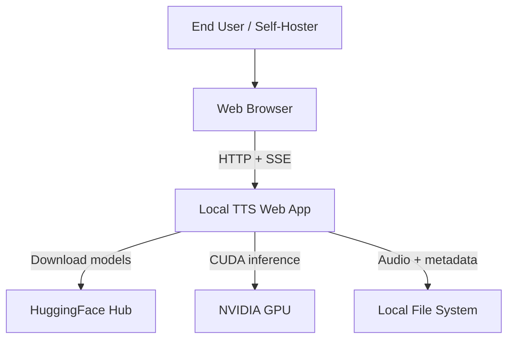

# Architecture

## Overview

Local TTS Web App is a **monolithic single-process application** consisting of a Python backend, a Vue 3 single-page application frontend, and SQLite for metadata storage. Audio files and TTS model caches are stored on the file system.

This architecture prioritizes simplicity and minimal operational overhead, driven by `CON-solo-developer` (solo maintainer) and `CON-single-user` (single-user deployment).

## System Context



The application runs entirely on the user's machine. The only external dependency is HuggingFace Hub for initial model downloads (`ASM-internet-for-model-download`). All TTS inference runs locally on the NVIDIA GPU (`CON-gpu-inference`, `CON-nvidia-gpu`).

## Component Architecture

```mermaid
graph TB
    subgraph Browser
        Vue[Vue 3 SPA]
    end

    subgraph "FastAPI Process &#40;127.0.0.1&#41;"
        API[REST API Layer]
        SSEEndpoint[SSE Endpoint]
        Static[Static File Server]

        subgraph "Application Services"
            LibSvc[Library Service]
            JobSvc[Job Service]
            ModelSvc[Model Service]
            MonSvc[Monitor Service]
        end

        subgraph "TTS Engine &#40;modular&#41;"
            Synth[Synthesizer]
            ModelLoader[Model Loader]
            GPUVal[GPU Validator]
            ChapterParser[Chapter Parser]
        end

        subgraph Storage
            DB[(SQLite)]
            AudioFS[Audio Files]
            ModelCache[Model Cache]
        end
    end

    Vue -->|HTTP| API
    Vue -->|SSE| SSEEndpoint
    Static -->|serves| Vue

    API --> LibSvc
    API --> JobSvc
    API --> ModelSvc
    API --> MonSvc

    JobSvc --> Synth
    ModelSvc --> ModelLoader
    ModelSvc --> GPUVal
    JobSvc --> ChapterParser

    LibSvc --> DB
    LibSvc --> AudioFS
    JobSvc --> DB
    JobSvc --> AudioFS
    ModelSvc --> ModelCache
    MonSvc --> GPUVal

    Synth --> ModelLoader
    ModelLoader -->|CUDA| GPU[NVIDIA GPU]
    ModelLoader -->|download| HF[HuggingFace Hub]
```



## Components

### Web Server (FastAPI)

**Responsibility**: HTTP request handling, routing, static file serving, SSE connections.

- Binds to `127.0.0.1` by default (`REQ-SEC-localhost-binding`)
- Serves the Vue 3 SPA as static files (production build)
- Provides REST API endpoints for all application services
- Provides SSE endpoint for real-time progress updates (`REQ-F-synthesis-progress`)
- On startup: validates GPU/CUDA availability via the TTS Engine (`REQ-F-gpu-validation`)
- On startup: displays the UI URL to the user (`REQ-USA-simple-setup`)

### Vue 3 Frontend (SPA)

**Responsibility**: User interface, client-side routing, audio playback.

- Built with Vite, served as static files by FastAPI in production
- During development, Vite dev server proxies API requests to FastAPI
- Manages audio playback with the HTML5 `<audio>` element (`ASM-browser-mp3-playback`)
- Persists playback position via API calls (`REQ-F-playback-resume`)
- Connects to SSE endpoint for real-time job progress (`REQ-F-synthesis-progress`)

**Views**:

| View | Requirements Addressed |
|------|----------------------|
| Audiobook Creation | `REQ-F-upload-text-file`, `REQ-F-synthesize-audiobook`, `REQ-F-voice-language-selection`, `REQ-F-synthesis-progress` |
| Library | `REQ-F-library-listing`, `REQ-F-delete-audiobook`, `REQ-F-download-audiobook` |
| Playback | `REQ-F-audiobook-playback`, `REQ-F-playback-resume`, `REQ-F-chapter-split-output` |
| Model Management | `REQ-F-model-listing`, `REQ-F-model-download`, `REQ-F-model-cache-view`, `REQ-F-model-delete` |
| Monitoring | `REQ-F-job-monitoring`, `REQ-F-resource-monitoring` |
| Text Preview | `REQ-F-text-preview` |

### Application Services

#### Library Service

- CRUD operations on audiobook metadata (title, source filename, creation date, chapters)
- Serves audio files for playback and download (`REQ-F-audiobook-playback`, `REQ-F-download-audiobook`)
- Manages playback position persistence (`REQ-F-playback-resume`)
- Deletes audiobook records and associated audio files (`REQ-F-delete-audiobook`)

#### Job Service

- Manages synthesis job lifecycle: queued → processing → completed / failed
- Runs synthesis in a background thread — sequential queue, one job at a time (`CON-single-user`)
- Reports progress via SSE (`REQ-F-synthesis-progress`)
- Performs disk space preflight check before starting (`REQ-F-disk-space-preflight`)
- Records performance metrics per run (`REQ-F-performance-logging`)
- On completion, stores the audiobook in the library automatically (`REQ-F-synthesize-audiobook`)
- Handles ephemeral text preview synthesis (`REQ-F-text-preview`)

#### Model Service

- Lists compatible HuggingFace TTS models with cache status (`REQ-F-model-listing`)
- Downloads and caches models with progress reporting (`REQ-F-model-download`)
- Provides model cache view with disk usage (`REQ-F-model-cache-view`)
- Deletes cached models; prevents deletion of the currently loaded model (`REQ-F-model-delete`)
- Checks disk space before model downloads (`REQ-F-model-download`)
- Checks VRAM availability before model loading (`REQ-F-gpu-validation`)

#### Monitor Service

- Polls CPU, memory, GPU utilization (`REQ-F-resource-monitoring`)
- Reports currently loaded model info (`REQ-F-resource-monitoring`)
- Exposes job status and history (`REQ-F-job-monitoring`)

### TTS Engine (Modular)

**Responsibility**: All TTS inference and GPU interaction, independent of the web framework.

This is a standalone Python module with a clean interface boundary (`REQ-MNT-modular-ai-layer`). It can be invoked from the web application or independently (e.g., via CLI or script).

**Sub-components**:

- **GPU Validator** — Verifies NVIDIA GPU + CUDA availability at startup; checks VRAM before model load (`REQ-F-gpu-validation`).
- **Model Loader** — Loads HuggingFace TTS models onto GPU; manages download and local cache via the HuggingFace Hub API (`REQ-F-model-download`).
- **Chapter Parser** — Detects chapter structure in text; splits into chunks (`REQ-F-chapter-split-output`). Detection patterns to be refined during implementation.
- **Synthesizer** — Converts text chunks to MP3 audio using the loaded model on GPU (`REQ-F-synthesize-audiobook`). Supports voice and language selection (`REQ-F-voice-language-selection`). Reports progress per chunk.

**Interface** (conceptual):

```python
class TTSEngine:
    def validate_gpu() -> GPUInfo
    def list_models() -> list[ModelInfo]
    def download_model(model_id, progress_callback) -> None
    def load_model(model_id, voice, language) -> None
    def synthesize(text, progress_callback) -> list[AudioChunk]
    def get_gpu_status() -> GPUStatus
```

### Storage

**SQLite Database** — stores metadata only:

- Audiobook records (title, source filename, creation date, chapter list)
- Playback positions (audiobook ID, chapter index, timestamp)
- Job history (status, timestamps, error details)
- Performance metrics (latency, resource usage per run)

**File System**:

- `data/audiobooks/<audiobook-id>/` — MP3 files organized by audiobook, one file per chapter
- HuggingFace Hub default cache directory — model files (managed by the `huggingface_hub` library)

## Cross-Cutting Concerns

### Startup Sequence

1. Validate NVIDIA GPU + CUDA (`REQ-F-gpu-validation`). If not found, display a clear error and exit.
2. Initialize SQLite database (create tables if needed).
3. Start FastAPI server on `127.0.0.1` (`REQ-SEC-localhost-binding`).
4. Display the UI URL to the user (`REQ-USA-simple-setup`).

### Error Handling

- **GPU/CUDA not found** → clear error message at startup; application does not start (`REQ-F-gpu-validation`)
- **Insufficient VRAM** → error before model load with required vs. available VRAM (`REQ-F-gpu-validation`)
- **Insufficient disk space** → error before synthesis or model download (`REQ-F-disk-space-preflight`, `REQ-F-model-download`)
- **Synthesis failure** → job marked as failed with error details, reported via SSE (`REQ-F-synthesis-progress`)

### Cross-Platform Support

All components use cross-platform APIs (`REQ-PORT-linux-windows`):

- Python `pathlib` for file paths (no hardcoded separators)
- SQLite via Python `sqlite3` standard library module (bundled with Python)
- `shutil.disk_usage()` for disk space checks
- CUDA via PyTorch (handles Linux/Windows differences internally)

### Compliance

All dependencies are free and open-source (`REQ-COMP-foss-only`, `CON-zero-budget`):

- Python, FastAPI, Uvicorn (MIT/BSD)
- Vue 3, Vite (MIT)
- PyTorch (BSD), HuggingFace Transformers/Hub (Apache 2.0)
- SQLite (public domain)

## Requirement Traceability

| Requirement | Priority | Component(s) |
|-------------|----------|--------------|
| `REQ-F-upload-text-file` | Must-have | REST API, Vue Frontend |
| `REQ-F-synthesize-audiobook` | Must-have | Job Service, TTS Engine |
| `REQ-F-chapter-split-output` | Must-have | TTS Engine (Chapter Parser) |
| `REQ-F-synthesis-progress` | Must-have | Job Service, SSE Endpoint, Vue Frontend |
| `REQ-F-disk-space-preflight` | Must-have | Job Service |
| `REQ-F-library-listing` | Must-have | Library Service, Vue Frontend |
| `REQ-F-audiobook-playback` | Must-have | Library Service, Vue Frontend |
| `REQ-F-playback-resume` | Must-have | Library Service, Vue Frontend |
| `REQ-F-delete-audiobook` | Must-have | Library Service |
| `REQ-F-model-listing` | Must-have | Model Service |
| `REQ-F-model-download` | Must-have | Model Service, TTS Engine |
| `REQ-F-gpu-validation` | Must-have | TTS Engine (GPU Validator), Web Server |
| `REQ-PORT-linux-windows` | Must-have | All (cross-platform APIs) |
| `REQ-COMP-foss-only` | Must-have | All (dependency selection) |
| `REQ-SEC-localhost-binding` | Must-have | Web Server |
| `REQ-F-download-audiobook` | Should-have | Library Service, Vue Frontend |
| `REQ-F-voice-language-selection` | Should-have | TTS Engine, Vue Frontend |
| `REQ-F-job-monitoring` | Should-have | Job Service, Monitor Service, Vue Frontend |
| `REQ-F-resource-monitoring` | Should-have | Monitor Service, TTS Engine, Vue Frontend |
| `REQ-USA-simple-setup` | Should-have | Web Server (startup sequence) |
| `REQ-F-performance-logging` | Should-have | Job Service |
| `REQ-MNT-modular-ai-layer` | Should-have | TTS Engine |
| `REQ-F-model-cache-view` | Should-have | Model Service |
| `REQ-F-model-delete` | Should-have | Model Service |
| `REQ-F-text-preview` | Should-have | Job Service, TTS Engine, Vue Frontend |
| `REQ-PERF-synthesis-latency` | Should-have | TTS Engine |
| `REQ-F-default-voice-quality` | Should-have | TTS Engine, Model Service |
| `REQ-PORT-browser-compat` | Should-have | Vue Frontend |

## Design Risks

| Risk | Severity | Mitigation |
|------|----------|------------|
| `ASM-huggingface-models-available` is unverified (High) | High | Model Service and TTS Engine depend on suitable models existing on HuggingFace. If invalidated, model listing and download components would need significant rework. Verify early in the Code phase. |
| `ASM-browser-mp3-playback` is unverified (Low) | Low | All modern desktop browsers support MP3 natively. Minimal risk. |
