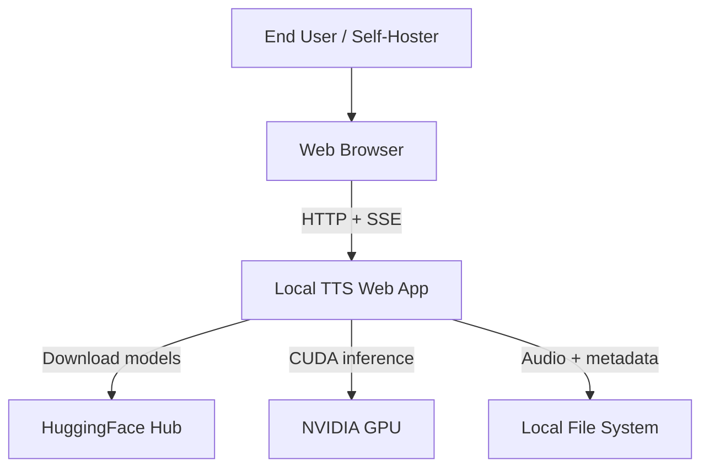
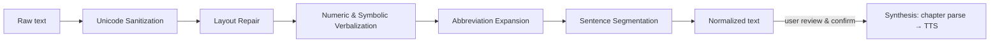

# Architecture

## Overview

Local TTS Web App is a **monolithic single-process application** consisting of a Python backend, a Vue 3 single-page application frontend, and SQLite for metadata storage. Audio files and TTS model caches are stored on the file system.

This architecture prioritizes simplicity and minimal operational overhead, driven by `CON-solo-developer` (solo maintainer) and `CON-single-user` (single-user deployment).

## System Context



The application runs entirely on the user's machine. The only external dependency is HuggingFace Hub for initial model downloads (`ASM-internet-for-model-download`). All TTS inference runs locally on the NVIDIA GPU (`CON-gpu-inference`, `CON-nvidia-gpu`).

## Component Architecture

```mermaid
graph TB
    subgraph Browser
        Vue[Vue 3 SPA]
    end

    subgraph "FastAPI Process &#40;127.0.0.1&#41;"
        API[REST API Layer]
        SSEEndpoint[SSE Endpoint]
        Static[Static File Server]

        subgraph "Application Services"
            LibSvc[Library Service]
            JobSvc[Job Service]
            ModelSvc[Model Service]
            MonSvc[Monitor Service]
            PreSvc[Preprocessing Service]
        end

        subgraph "TTS Subpackage &#40;modular&#41;"
            Synth[Synthesizer]
            ModelLoader[Model Loader]
            GPUVal[GPU Validator]
            ChapterParser[Chapter Parser]
        end

        subgraph Storage
            DB[(SQLite)]
            AudioFS[Audio Files]
            ModelCache[Model Cache]
        end
    end

    Vue -->|HTTP| API
    Vue -->|SSE| SSEEndpoint
    Static -->|serves| Vue

    API --> LibSvc
    API --> JobSvc
    API --> ModelSvc
    API --> MonSvc
    API --> PreSvc

    JobSvc --> Synth
    ModelSvc --> ModelLoader
    ModelSvc --> GPUVal
    JobSvc --> ChapterParser
    PreSvc -->|reads loaded model| ModelSvc

    LibSvc --> DB
    LibSvc --> AudioFS
    JobSvc --> DB
    JobSvc --> AudioFS
    ModelSvc --> ModelCache
    MonSvc --> GPUVal

    Synth --> ModelLoader
    ModelLoader -->|CUDA| GPU[NVIDIA GPU]
    ModelLoader -->|download| HF[HuggingFace Hub]
```



## Components

### Web Server (FastAPI)

**Responsibility**: HTTP request handling, routing, static file serving, SSE connections.

- Binds to `127.0.0.1` by default (`REQ-SEC-localhost-binding`)
- Serves the Vue 3 SPA as static files (production build)
- Provides REST API endpoints for all application services
- Provides SSE endpoint for real-time progress updates (`REQ-F-synthesis-progress`)
- On startup: validates GPU/CUDA availability via the TTS subpackage (`REQ-F-gpu-validation`)
- On startup: displays the UI URL to the user (`REQ-USA-simple-setup`)

### Vue 3 Frontend (SPA)

**Responsibility**: User interface, client-side routing, audio playback.

- Built with Vite, served as static files by FastAPI in production
- During development, Vite dev server proxies API requests to FastAPI
- Manages audio playback with the HTML5 `<audio>` element (`ASM-browser-mp3-playback`)
- Persists playback position via API calls (`REQ-F-playback-resume`)
- Connects to SSE endpoint for real-time job progress (`REQ-F-synthesis-progress`)

**Views**:

| View | Requirements Addressed |
|------|----------------------|
| Audiobook Creation | `REQ-F-upload-text-file`, `REQ-USA-normalized-text-review`, `REQ-F-synthesize-audiobook`, `REQ-F-voice-language-selection`, `REQ-F-synthesis-progress` |
| Library | `REQ-F-library-listing`, `REQ-F-delete-audiobook`, `REQ-F-download-audiobook` |
| Playback | `REQ-F-audiobook-playback`, `REQ-F-playback-resume`, `REQ-F-chapter-split-output` |
| Model Management | `REQ-F-model-listing`, `REQ-F-model-download`, `REQ-F-model-cache-view`, `REQ-F-model-delete` |
| Monitoring | `REQ-F-job-monitoring`, `REQ-F-resource-monitoring` |
| Text Preview | `REQ-F-text-preview`, `REQ-USA-normalized-text-review` |

### Application Services

#### Library Service

- CRUD operations on audiobook metadata (title, source filename, creation date, chapters)
- Serves audio files for playback and download (`REQ-F-audiobook-playback`, `REQ-F-download-audiobook`)
- Manages playback position persistence (`REQ-F-playback-resume`)
- Deletes audiobook records and associated audio files (`REQ-F-delete-audiobook`)

#### Job Service

- Manages synthesis job lifecycle: queued → processing → completed / failed
- Runs synthesis in a background thread — sequential queue, one job at a time (`CON-single-user`)
- Reports progress via SSE (`REQ-F-synthesis-progress`)
- Performs disk space preflight check before starting (`REQ-F-disk-space-preflight`)
- Records performance metrics per run (`REQ-F-performance-logging`)
- On completion, stores the audiobook in the library automatically (`REQ-F-synthesize-audiobook`)
- Handles ephemeral text preview synthesis (`REQ-F-text-preview`). Preview audio is stored as a single file at `data/temp/preview.mp3`, overwritten by each new preview job. Deleted when fetched via the API and purged on server startup (`CON-single-user`)

#### Model Service

- Lists compatible HuggingFace TTS models with cache status (`REQ-F-model-listing`)
- Downloads and caches models with progress reporting (`REQ-F-model-download`)
- Provides model cache view with disk usage (`REQ-F-model-cache-view`)
- Deletes cached models; prevents deletion of the currently loaded model (`REQ-F-model-delete`)
- Checks disk space before model downloads (`REQ-F-model-download`)
- Checks VRAM availability before model loading (`REQ-F-gpu-validation`)

#### Monitor Service

- Polls CPU, memory, GPU utilization (`REQ-F-resource-monitoring`)
- Reports currently loaded model info (`REQ-F-resource-monitoring`)
- Exposes job status and history (`REQ-F-job-monitoring`)

#### Preprocessing Service

Transforms raw input text into TTS-ready text before synthesis (`GOAL-text-normalization`, `DEC-text-preprocessing-pipeline`). A dedicated backend service — **not** part of the TTS subpackage, which stays focused on GPU inference.

- Runs a modular pipeline of discrete, independently testable stages (`REQ-MNT-preprocessing-pipeline`) — see [Text Preprocessing Pipeline](#text-preprocessing-pipeline) below.
- Synchronous and CPU-bound; completes within bounded time (`REQ-PERF-preprocessing-overhead`: ≤10 s for ~2 MB, ≤1 s for ≤500-char preview).
- Reads the currently loaded model (via the Model Service) to select the model-specific preprocessing configuration.
- Returns the normalized text for the user to review and confirm before generation (`REQ-USA-normalized-text-review`, `DEC-preprocess-review-flow`); it does not persist anything.
- Layout repair runs before chapter detection (which stays in the Job Service → Chapter Parser path), so reflow operates on the full document while chapter boundaries are preserved (`REQ-F-text-layout-repair`, `REQ-F-chapter-split-output`).

### TTS Subpackage (Modular)

**Responsibility**: All TTS inference and GPU interaction, independent of the web framework.

This is a dedicated subpackage within the backend component (`DEC-tts-as-backend-module`) with a clean interface boundary (`REQ-MNT-modular-ai-layer`). It is imported by backend application services via direct function calls (`DEC-single-process`). The dependency is unidirectional: services → TTS subpackage, never the reverse.

**Modules**:

- **GPU Validator** — Verifies NVIDIA GPU + CUDA availability at startup; checks VRAM before model load (`REQ-F-gpu-validation`).
- **Model Loader** — Manages model download, caching, and GPU loading. Download and cache management use a uniform HuggingFace Hub API (`REQ-F-model-download`). **Model loading uses a model adapter abstraction** — each TTS model requires a model-specific adapter because TTS models do not share a common loading or inference interface (see [Model-Specific Loading Requirements](#model-specific-loading-requirements) below).
- **Chapter Parser** — Detects chapter structure in text; splits into chunks (`REQ-F-chapter-split-output`). Detection patterns to be refined during implementation.
- **Synthesizer** — Converts text chunks to MP3 audio using the loaded model on GPU (`REQ-F-synthesize-audiobook`). Chunks the confirmed text **one line per segment** — the line division produced by the preprocessing pipeline's sentence-segmentation stage — splitting on newlines only (not punctuation), so the spoken chunks match the reviewed text; a short silence is inserted between chunks. Supports voice and language selection (`REQ-F-voice-language-selection`). Reports progress per chunk. Delegates model-specific inference to the adapter provided by the Model Loader.

**Interface** (conceptual):

```python
class TTSEngine:
    def validate_gpu() -> GPUInfo
    def list_models() -> list[ModelInfo]
    def download_model(model_id, progress_callback) -> None
    def load_model(model_id, voice, language) -> None
    def synthesize(text, progress_callback) -> list[AudioChunk]
    def get_gpu_status() -> GPUStatus
```

### Text Preprocessing Pipeline

The Preprocessing Service runs a modular pipeline of discrete, independently unit-testable stages (`REQ-MNT-preprocessing-pipeline`, `DEC-text-preprocessing-pipeline`). Default stage order (config-driven, refined through testing):

| Order | Stage | Responsibility | Requirement |
|-------|-------|----------------|-------------|
| 1 | Unicode Sanitization | Remove invisible/control chars; NBSP and whitespace variants → normal spaces; normalize dash/quote variants; remove disallowed Unicode; emoji removed or verbalized per config | `REQ-F-text-unicode-sanitization` |
| 2 | Layout Repair | Resolve end-of-line hyphenation; reflow sentences split across hard line breaks; strip isolated page numbers/layout fragments; normalize irregular whitespace; preserve paragraph and chapter boundaries | `REQ-F-text-layout-repair` |
| 3 | Numeric & Symbolic Verbalization | Spell out cardinals/ordinals, dates, percentages, currency, and common symbols, language-aware | `REQ-F-text-numeric-symbolic-verbalization` |
| 4 | Abbreviation Expansion | Verbalize common abbreviations/acronyms from a language-specific built-in set; apply an optional domain dictionary when supplied | `REQ-F-abbreviation-expansion` |
| 5 | Sentence Segmentation | Put each sentence on its own line; the synthesizer chunks one line per segment, so this stage **defines** the TTS chunking and the reviewed text matches the spoken chunks. Runs **last**, after numbers and abbreviations are expanded, so a sentence-ending period is not confused with a thousands separator (`11.988`) or an abbreviation dot (`E.F.`). Also isolates spoken dialogue: breaks before `«` and after `»` so the quote and any dialogue tag are distinct chunks, then flattens the guillemets to `"` (the Unicode stage leaves `«`/`»` intact for this) | `REQ-F-text-layout-repair` |



**Configuration (two axes, `REQ-MNT-preprocessing-pipeline`):**

- **Language profile** — keyed by output language code (default `it`, `DEC-default-italian-language`): verbalization rule tables and the built-in abbreviation set. A language with no registered data is **rejected** (the `/preprocess` API returns 400) rather than silently passing the text through unchanged, since preprocessing rewrites are language-specific.
- **Model profile** — keyed by `model_id`, with a default fallback: which stages run and their parameters, accommodating different models' input expectations without modifying shared stage logic.
- **Optional domain dictionary** — a file on disk (e.g. `config/preprocessing/domain_dictionary.json`) mapping acronyms/technical terms to spoken forms; applied when present, built-in defaults otherwise (`REQ-F-abbreviation-expansion`). Delivery mechanism refinable.

Adding a new language or model is done by adding a profile/stage, not by editing existing shared stage logic.

### Storage

**SQLite Database** — stores metadata only:

- Audiobook records (title, source filename, creation date, chapter list)
- Audiobook-level bookmarks (last active chapter per audiobook)
- Per-chapter bookmarks (playback timestamp within each listened chapter)
- Job history (status, timestamps, error details)
- Performance metrics (latency, resource usage per run)

**File System**:

- `data/audiobooks/<audiobook-id>/` — MP3 files organized by audiobook, one file per chapter
- HuggingFace Hub default cache directory — model files (managed by the `huggingface_hub` library)

## Cross-Cutting Concerns

### Startup Sequence

1. Validate NVIDIA GPU + CUDA (`REQ-F-gpu-validation`). If not found, display a clear error and exit.
2. Initialize SQLite database (create tables if needed).
3. Start FastAPI server on `127.0.0.1` (`REQ-SEC-localhost-binding`).
4. Display the UI URL to the user (`REQ-USA-simple-setup`).

### Error Handling

- **GPU/CUDA not found** → clear error message at startup; application does not start (`REQ-F-gpu-validation`)
- **Insufficient VRAM** → error before model load with required vs. available VRAM (`REQ-F-gpu-validation`)
- **Insufficient disk space** → error before synthesis or model download (`REQ-F-disk-space-preflight`, `REQ-F-model-download`)
- **Synthesis failure** → job marked as failed with error details, reported via SSE (`REQ-F-synthesis-progress`)

### Cross-Platform Support

All components use cross-platform APIs (`REQ-PORT-linux-windows`):

- Python `pathlib` for file paths (no hardcoded separators)
- SQLite via Python `sqlite3` standard library module (bundled with Python)
- `shutil.disk_usage()` for disk space checks
- CUDA via PyTorch (handles Linux/Windows differences internally)

### Compliance

All dependencies are free and open-source (`REQ-COMP-foss-only`, `CON-zero-budget`):

- Python, FastAPI, Uvicorn (MIT/BSD)
- Vue 3, Vite (MIT)
- PyTorch (BSD), HuggingFace Transformers/Hub (Apache 2.0)
- SQLite (public domain)

## Requirement Traceability

| Requirement | Priority | Component(s) |
|-------------|----------|--------------|
| `REQ-F-upload-text-file` | Must-have | REST API, Vue Frontend |
| `REQ-F-synthesize-audiobook` | Must-have | Job Service, TTS Subpackage |
| `REQ-F-chapter-split-output` | Must-have | TTS Subpackage (Chapter Parser) |
| `REQ-F-synthesis-progress` | Must-have | Job Service, SSE Endpoint, Vue Frontend |
| `REQ-F-disk-space-preflight` | Must-have | Job Service |
| `REQ-F-library-listing` | Must-have | Library Service, Vue Frontend |
| `REQ-F-audiobook-playback` | Must-have | Library Service, Vue Frontend |
| `REQ-F-playback-resume` | Must-have | Library Service, Vue Frontend |
| `REQ-F-delete-audiobook` | Must-have | Library Service |
| `REQ-F-model-listing` | Must-have | Model Service |
| `REQ-F-model-download` | Must-have | Model Service, TTS Subpackage |
| `REQ-F-gpu-validation` | Must-have | TTS Subpackage (GPU Validator), Web Server |
| `REQ-PORT-linux-windows` | Must-have | All (cross-platform APIs) |
| `REQ-COMP-foss-only` | Must-have | All (dependency selection) |
| `REQ-SEC-localhost-binding` | Must-have | Web Server |
| `REQ-F-download-audiobook` | Should-have | Library Service, Vue Frontend |
| `REQ-F-voice-language-selection` | Should-have | TTS Subpackage, Vue Frontend |
| `REQ-F-job-monitoring` | Should-have | Job Service, Monitor Service, Vue Frontend |
| `REQ-F-resource-monitoring` | Should-have | Monitor Service, TTS Subpackage, Vue Frontend |
| `REQ-USA-simple-setup` | Should-have | Web Server (startup sequence) |
| `REQ-F-performance-logging` | Should-have | Job Service |
| `REQ-MNT-modular-ai-layer` | Should-have | TTS Subpackage |
| `REQ-F-model-cache-view` | Should-have | Model Service |
| `REQ-F-model-delete` | Should-have | Model Service |
| `REQ-F-text-preview` | Should-have | Job Service, TTS Subpackage, Vue Frontend |
| `REQ-PERF-synthesis-latency` | Should-have | TTS Subpackage |
| `REQ-F-default-voice-quality` | Should-have | TTS Subpackage, Model Service |
| `REQ-PORT-browser-compat` | Should-have | Vue Frontend |
| `REQ-F-text-unicode-sanitization` | Must-have | Preprocessing Service (Unicode Sanitization stage) |
| `REQ-F-text-layout-repair` | Must-have | Preprocessing Service (Layout Repair stage) |
| `REQ-F-text-numeric-symbolic-verbalization` | Must-have | Preprocessing Service (Numeric & Symbolic Verbalization stage) |
| `REQ-F-abbreviation-expansion` | Should-have | Preprocessing Service (Abbreviation Expansion stage) |
| `REQ-MNT-preprocessing-pipeline` | Should-have | Preprocessing Service |
| `REQ-PERF-preprocessing-overhead` | Should-have | Preprocessing Service |
| `REQ-USA-normalized-text-review` | Should-have | Preprocessing Service, REST API, Vue Frontend |

## Model-Specific Loading Requirements

TTS models on HuggingFace Hub do **not** share a common loading or inference interface. Each model requires its own library, model class, or loading procedure. The generic `AutoModel.from_pretrained()` approach (even with `trust_remote_code=True`) does not work for most models. The Model Loader must provide a **model adapter abstraction** — a common `ModelAdapter` protocol that each model-specific adapter implements, covering loading, inference, and unloading.

> **transformers baseline (currently EXPLORATORY / in flux — `DEC-transformers-5x-baseline`):** MOSS-TTSD v1.0 needs transformers **≥5.0**, whereas Fish Audio S2-Pro's `fish-speech` loader hard-pins **`transformers<=4.57.3`** (and `torch==2.8.0`) — a single environment cannot host both. (Higgs Audio v3 was *expected* to also need transformers 5.x, but it turned out to be **server-only / not a transformers model at all** — see the Compatibility Table row — so it no longer factors into the version requirement; **MOSS-TTSD is the binding ≥5.x driver**.) The user put the baseline in an exploratory state (2026-06-21): the `pyproject` pin is widened to **`transformers>=4.38`** and the operator installs the major the model under trial needs (currently **`4.57.3`**, flipped down 2026-06-21 to exercise **Qwen3-TTS** — the version its `qwen-tts` package requires — and Fish Audio S2-Pro). Under a 4.57.3 install, Qwen3-TTS and Fish S2-Pro load but MOSS-TTSD is not loadable at runtime (documented trade-off); under a 5.x install, the inverse. The **Qwen3-TTS adapter is now registered** like the others: `qwen-tts` requires transformers 4.57.3 and works **natively** at that baseline (no shims — verified end-to-end on GPU), so it is a GPU-host dependency installed when the baseline is 4.57.3 (`pip install qwen-tts`); whether any of these adapters loads is purely a function of the installed transformers major. (CosyVoice 3's `cosyvoice` package adds a **third** distinct constraint — it hard-pins `transformers==4.51.3` / `torch==2.3.1` / `numpy==1.26.4` — so it too is a GPU-host-only dependency installed in a dedicated environment, never a backend runtime dep.) For models loaded via `trust_remote_code`, prefer pinning the repo `revision` so the downloaded code cannot silently drift — **unless** the loader forwards `revision` into a different-repo sub-component (MOSS-TTSD propagates it to its companion codec, so that adapter must load at HEAD). To be re-fixed to a single stable baseline later.

### Compatibility Table

| Model ID | AutoModel Compatible | Required Library / Approach | Notes |
|----------|---------------------|----------------------------|-------|
| `ResembleAI/chatterbox` | No | `chatterbox-tts` pip package, `ChatterboxTTS.from_pretrained()` | Multiple weight files, no transformers config |
| `Qwen/Qwen3-TTS-12Hz-1.7B-CustomVoice` | No | `qwen-tts` pip package, `Qwen3TTSModel` | `model_type: qwen3_tts` not in standard transformers; needs custom tokenizer + speech tokenizer. **Adapter registered** (`loader_available=true`). Loadable **only when the exploratory baseline is installed at transformers 4.57.3** — the version `qwen-tts` requires; it works natively there (verified end-to-end on GPU, 24 kHz Italian). At a transformers ≥5.x install it is registered but not loadable (the inverse trade-off vs MOSS-TTSD — `DEC-transformers-5x-baseline`). `qwen-tts` is a GPU-host dependency (`pip install qwen-tts`), not a backend runtime dep |
| `FunAudioLLM/Fun-CosyVoice3-0.5B-2512` | No | CosyVoice `cosyvoice` package, its **own** `AutoModel` (`from cosyvoice.cli.cosyvoice import AutoModel`; `AutoModel(model_dir=…)` loaded from the HF-cached snapshot) — **not** HuggingFace's `AutoModel`; inference via `inference_zero_shot(text, prompt_text, prompt_wav_path)` / `inference_cross_lingual(text, prompt_wav_path)` yielding a generator of `{"tts_speech": <tensor>}` chunks | **Apache-2.0 (FOSS).** Custom weight format (`.pt`, `.onnx`), no transformers-compatible structure. **Adapter registered** (`loader_available=true`). **Auto-detect** language (like VoxCPM2/MOSS-TTSD/Fish S2-Pro — no per-call language argument; the adapter validates the ISO code + defaults Italian but does **not** forward it). **Requires a reference voice clip** (`voice` = path to a 3–10 s `.wav`; with an optional `prompt_text` transcript → zero-shot, else cross-lingual): CosyVoice 3 ships **no built-in/SFT speaker** (no `spk2info.pt`, no bundled prompt), so it needs a `voice` reference clip; as a **temporary stopgap until Phase 6 voice selection**, when no `voice` is given the adapter falls back to a user-provided default clip at the repo-root `wavs/default.mp3` (`config.DEFAULT_VOICE_PATH`, gitignored) when present, else raises a clear error. 24 kHz (read from `model.sample_rate`). The `cosyvoice` package **hard-pins `transformers==4.51.3` / `torch==2.3.1` / `numpy==1.26.4`** (verified against upstream `requirements.txt`) — a third, distinct pin vs. qwen-tts (`==4.57.3`) / fish-speech (`<=4.57.3`+`torch==2.8.0`) / MOSS-TTSD (`>=5.x`); per `DEC-transformers-5x-baseline` it is therefore a **GPU-host dependency** (lazy-imported, mocked in tests), not a backend runtime dep, and full-weight validation is a GPU-host step |
| `hexgrad/Kokoro-82M` | No | `kokoro` pip package (`>=0.9.2`), `KPipeline` | StyleTTS2/ISTFTNet architecture, `.pth` weight file |
| `bosonai/higgs-audio-v2-generation-3B-base` | Yes (transformers>=5.3) | `HiggsAudioV2ForConditionalGeneration` or `AutoModelForTextToWaveform` | Requires transformers 5.3+; `AutoModel` may not map correctly |
| `coqui/XTTS-v2` | No | Coqui `coqui-tts` package — **low-level `Xtts` API** (`XttsConfig().load_json` → `Xtts.init_from_config` → `Xtts.load_checkpoint(checkpoint_dir=…)`) loaded from the HF-cached snapshot, then `Xtts.synthesize(text, speaker=…, speaker_wav=…, language=…)` (coqui-tts ≥0.27 keyword-only; the old `config`/`speaker_id` positional+kwarg are deprecated). (The model card's high-level `TTS("tts_models/multilingual/multi-dataset/xtts_v2")` form auto-downloads to Coqui's own dir; the adapter loads from the Model-Loader HF cache instead — consistent with the other adapters.) | ⚠️ **Coqui Public Model License (CPML) — non-commercial, not OSI/FOSS** (free for personal use; commercial use is paid). License notice required in the UI per `DEC-model-license-disclosure`. **Translate-ISO** language (17 langs incl. first-class Italian; `it`→`it`, only `zh`→`zh-cn` differs — XTTS takes an *explicit* language, NOT auto-detect — like Kokoro/Qwen3; the adapter's language set is verified equal to the model's real `config.languages`); built-in cross-lingual studio speakers selected by `voice` (default `Claribel Dervla`; no Italian-named speaker, but cross-lingual) **or** optional `speaker_wav` zero-shot cloning; 24 kHz. **Adapter registered** (`loader_available=true`). XTTS exposes no flag to disable its internal tokenizer-level text cleaning, so the `normalize=False` confirmed-text lever (VoxCPM2/Fish) does not apply — documented limitation (upstream preprocessing already verbalizes numbers/dates, so the residual cleaning is largely a no-op). The maintained **`coqui-tts` fork (0.27.5) is compatible** with this baseline (`transformers>=4.57`/no torch pin/`numpy>=1.26`/Python >=3.10,<3.15) and installs without downgrade (verified 2026-06-21); because it does **not** conflict (unlike qwen-tts/fish-speech) it is a **declared backend dependency** (`coqui-tts>=0.27` in `pyproject.toml`, like kokoro/voxcpm), lazy-imported at load and mocked in tests. The *archived original* `TTS` 0.22.0 is the incompatible one (old transformers/torch pins, Python <3.12) — use the fork (`DEC-transformers-5x-baseline`) |
| `fishaudio/fish-speech-1.5` | No | Fish Speech GitHub repo | `model_type: dual_ar` not in transformers; `.pth` format |
| `canopylabs/orpheus-3b-0.1-ft` | Partial | `orpheus-speech` pip package, `OrpheusModel` | LLM (`LlamaForCausalLM`) loads via `AutoModelForCausalLM`, but audio decoding requires separate codec pipeline |
| `SWivid/F5-TTS` | No | `f5-tts` pip package, high-level `f5_tts.api.F5TTS` class (`F5TTS(model="F5TTS_v1_Base", device=…)`, checkpoint resolved from the HF-cached `SWivid/F5-TTS` snapshot); inference via `F5TTS.infer(ref_file, ref_text, gen_text)` returning `(wav, sample_rate, spectrogram)` | ⚠️ **CC-BY-NC-4.0 weights — non-commercial, not OSI/FOSS** (the code is MIT; free for personal use, commercial use is not permitted). License notice required in the UI per `DEC-model-license-disclosure`. Custom flow-matching DiT architecture, `.safetensors`, no transformers structure. **Adapter registered** (`loader_available=true`). **Auto-detect** language (like VoxCPM2/MOSS-TTSD/Fish S2-Pro/CosyVoice 3 — no language argument; the adapter validates the ISO code + defaults Italian but does **not** forward it). **Requires a reference voice clip** (zero-shot cloning; F5-TTS has **no built-in speaker**): `voice` = path to a few-second reference clip, with an optional `prompt_text` transcript (omitted → F5-TTS auto-transcribes the reference via ASR). As a **temporary stopgap until Phase 6 voice selection**, when no `voice` is given the adapter falls back to a user-provided default clip at the repo-root `wavs/default.mp3` (`config.DEFAULT_VOICE_PATH`, gitignored) when present, else raises a clear error (the CosyVoice 3 pattern). 24 kHz (read from `model.target_sample_rate`). F5-TTS does no number/abbreviation expansion of its own, so the `normalize=False` lever is not needed. The `f5-tts` package pins `numpy<=1.26.4` on Python ≤3.10 (conflicting with the baseline's numpy 2.x) and pulls a heavy dependency tree; per `DEC-transformers-5x-baseline` it is therefore a **GPU-host dependency** (lazy-imported, mocked in tests), not a backend runtime dep, and full-weight validation is a GPU-host step |
| `parler-tts/parler-tts-mini-multilingual-v1.1` | No (without extra pkg) | `parler-tts` GitHub package, `ParlerTTSForConditionalGeneration` | `model_type: parler_tts` not in standard transformers |
| `Zyphra/Zonos-v0.1-transformer` | No | `zonos` pip package, `Zonos.from_pretrained()` | Mamba/transformer backbone, custom config |
| `nari-labs/Dia-1.6B-0626` | Yes (transformers>=5.x) | `DiaForConditionalGeneration` or `dia` pip package | Merged into transformers 5.x+; also has standalone `dia` library |
| `openbmb/VoxCPM2` | No | `voxcpm` pip package, `VoxCPM.from_pretrained()` | **Apache-2.0 (FOSS).** 30 languages incl. Italian (auto-detected, no language tag needed); 48 kHz output; ~2B params, ~8 GB VRAM |
| `OpenMOSS-Team/MOSS-TTSD-v1.0` | Via `trust_remote_code` | `AutoModel` / `AutoProcessor` with `trust_remote_code=True` + companion audio tokenizer (`OpenMOSS-Team/MOSS-Audio-Tokenizer`); `model.generate` in the processor's **generation** mode over a `[S1]`…`[S5]` speaker-tagged conversation (single-voice narration = a lone `[S1]` user message) | **Apache-2.0 (FOSS).** 20 languages incl. Italian (auto-detected, no language tag needed — like VoxCPM2; the older `fnlp/MOSS-TTSD-v0.5` is CN/EN only — use v1.0 for Italian); dialogue / multi-speaker–oriented (architectural mismatch for single-voice narration — the adapter wraps text as a single `[S1]` turn); zero-shot voice cloning from an optional reference clip; 24 kHz; ~8B params, ~19 GB VRAM (exceeds the min-spec 4 GB GPU). **Requires transformers ≥5.0** — the model's remote code imports the 5.x `transformers.initialization` module and its companion audio tokenizer imports `PreTrainedConfig`; this drove the backend baseline to `transformers>=5.5` (`DEC-transformers-5x-baseline`). Loaded at HEAD — the model's processor forwards a `revision` kwarg into the **separate** codec repo, so pinning the model revision 404s the codec load; stability relies on the transformers baseline instead |
| `fishaudio/s2-pro` | No | `fish-speech` v2.x engine (`TTSInferenceEngine` over a text2semantic queue + DAC decoder; `ServeTTSRequest`); GitHub-only package, gated HF download | ⚠️ **Fish Audio Research License — non-commercial, not OSI/FOSS** (free for personal use; commercial use is paid). License notice required in the UI per `DEC-model-license-disclosure`. Dual-AR (4B slow + 400M fast); 80+ languages incl. Italian **(auto-detected, no language tag — `ServeTTSRequest` has no language field)**; 44.1 kHz; ~5B params, 12–24 GB VRAM. Adapter forces `normalize=False` (`DEC-preprocess-review-flow`). **`fish-speech` v2.0.0 is GitHub-only and pins `torch==2.8.0` / `transformers<=4.57.3`** — mutually exclusive with the 5.x models; it is a GPU-host dependency (lazy-imported, mocked in tests) and drove the exploratory transformers baseline (`DEC-transformers-5x-baseline`) |
| `bosonai/higgs-audio-v3-tts-4b` | **No — not in-process (server-only)** | ⚠️ **No in-process loader exists.** Despite the custom arch `HiggsMultimodalQwen3ForConditionalGeneration` (`model_type: higgs_multimodal_qwen3`), that architecture is **absent from the `transformers` library** (released 5.12.1 *and* `main`, verified 2026-06-21) and the HF repo ships **no remote code** (no `auto_map`/`*.py`), so `trust_remote_code` can't help. Boson publishes v3 **only as a server** — vLLM-Omni (`vllm-omni serve … --trust-remote-code --omni`) or the SGLang-Omni Docker image — which conflicts with `DEC-single-process`. **Adapter implemented but UNREGISTERED** (`loader_available=false`); the `higgs_audio_v3.py` module + tests are retained on the bet that transformers adds native `higgs_multimodal_qwen3` support, at which point the in-process `text-to-speech` pipeline path can be re-registered | ⚠️ **Boson Research & Non-Commercial License — not OSI/FOSS** (free for personal use; commercial use is paid). License notice required in the UI per `DEC-model-license-disclosure` (the model stays **listed** with its notice, like other no-adapter models). 102 languages incl. Italian (auto-detected — no documented path takes a language tag); 24 kHz; ~4B params, ~9.3 GB weights. Zero-shot voice cloning from an optional reference clip (+transcript) |

### Adapter Pattern

Each compatible model is annotated with a `loader_available` flag. The frontend model-listing view groups models into **two separate lists** by this flag: a first list of models **with an available adapter** (`loader_available = true`, downloadable and loadable) and a second list of models **whose adapter is not yet available** (`loader_available = false`, shown for visibility but with download and load unavailable). As adapters are implemented, models move from the second list to the first. The `ModelAdapter` protocol defines:

- `load(model_id, device) -> None` — load model and tokenizer/processor onto the specified device
- `synthesize(text, **kwargs) -> numpy.ndarray` — run inference and return raw audio samples
- `sample_rate -> int` — the model's output sample rate
- `unload() -> None` — release GPU memory

The application layer speaks **ISO 639-1 language codes** (`it`, `en`, …) — the same codes used by the preprocessing pipeline and `DEC-default-italian-language`, forwarded through the synthesis request to `synthesize(language=…)`. TTS models, however, use their own language identifiers (Kokoro: single-char codes like `i`; Qwen3: full names like `Italian`). Each adapter is therefore responsible for **translating the incoming ISO 639-1 code to its model-specific identifier** (and should accept its native identifiers too, plus raise a clear error for an unrecognized language). This keeps the application layer model-agnostic and localizes language naming in the adapters.

### Model Licensing & Frontend Disclosure

Per `REQ-COMP-foss-only` (AC2) and `CON-zero-budget`, every supported model must be open-weight and freely licensed for personal use. Models fall into two license classes:

- **OSI open-source** (Apache-2.0 / MIT) — e.g. Kokoro, Qwen3-TTS, VoxCPM2, MOSS-TTSD. No usage caveat.
- **Open-weight but research / non-commercial** — Fish Audio S2-Pro (`fishaudio/s2-pro`, Fish Audio Research License) and Higgs Audio v3 (`bosonai/higgs-audio-v3-tts-4b`, Boson Research & Non-Commercial License), plus three models already in the catalog whose **weights** carry a non-commercial license even though their code is FOSS — XTTS-v2 (`coqui/XTTS-v2`, Coqui Public Model License), Fish Speech v1.5 (`fishaudio/fish-speech-1.5`, CC-BY-NC-SA-4.0) and F5-TTS (`SWivid/F5-TTS`, CC-BY-NC-4.0). They run fully locally and are free for this personal, single-user deployment, but are **not** OSI open-source and require a separate paid license for commercial use.

Per `DEC-model-license-disclosure`, non-OSI models are permitted under the personal-use reading of `REQ-COMP-foss-only` AC2, but their differing terms must be disclosed: each `COMPATIBLE_MODELS` entry carries license metadata (`license`, `license_is_foss`, and a `license_notice` when not FOSS), the `GET /models` response exposes it, and the **frontend model-listing view displays a visible license notice for any model whose license is not FOSS** (`REQ-F-model-listing`) so the user sees the usage terms before downloading or using it.

## Design Risks

No unverified high-risk assumptions remain. The `GET /models/{id}/voices` endpoint will likely need model-specific adapters due to varying voice/language metadata formats across HuggingFace TTS models (see `ASM-huggingface-models-available` verification notes).
