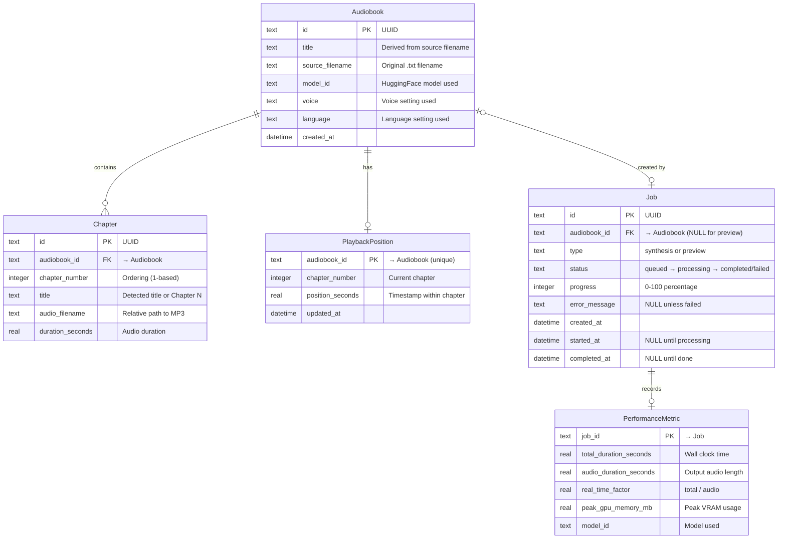
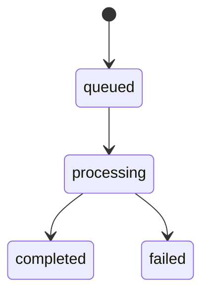

# Data Model

## Overview

The data model uses SQLite for structured metadata and the file system for audio files (`DEC-sqlite-metadata`). It defines the minimal set of entities needed to support the architecture's four application services (Library, Job, Model, Monitor).

## Entity-Relationship Diagram



## Entities

### Audiobook

One record per generated audiobook. Created by the Job Service when a synthesis job completes successfully (`REQ-F-synthesize-audiobook`). Displayed in the library view (`REQ-F-library-listing`).

| Column | Type | Constraints | Description |
|--------|------|-------------|-------------|
| `id` | TEXT | PK | UUID |
| `title` | TEXT | NOT NULL | Derived from source filename |
| `source_filename` | TEXT | NOT NULL | Original .txt filename |
| `model_id` | TEXT | NOT NULL | HuggingFace model ID used for synthesis |
| `voice` | TEXT | | Voice setting used (`REQ-F-voice-language-selection`) |
| `language` | TEXT | | Language setting used (`REQ-F-voice-language-selection`) |
| `created_at` | DATETIME | NOT NULL | Timestamp of creation |

**Lifecycle**: Created on synthesis completion → deleted by user (`REQ-F-delete-audiobook`). Deletion cascades to chapters, playback position, and audio files on disk.

### Chapter

One record per audio file within an audiobook (`REQ-F-chapter-split-output`). If no chapter structure is detected, a single chapter record is created.

| Column | Type | Constraints | Description |
|--------|------|-------------|-------------|
| `id` | TEXT | PK | UUID |
| `audiobook_id` | TEXT | FK → Audiobook, NOT NULL | Parent audiobook |
| `chapter_number` | INTEGER | NOT NULL | Ordering within audiobook (1-based) |
| `title` | TEXT | NOT NULL | Detected chapter title or "Chapter N" |
| `audio_filename` | TEXT | NOT NULL | Relative path to MP3 file within audiobook directory |
| `duration_seconds` | REAL | | Audio duration (populated after encoding) |

**Lifecycle**: Created during synthesis (one per detected chapter) → deleted when parent audiobook is deleted.

### PlaybackPosition

Persists the user's last playback position for an audiobook (`REQ-F-playback-resume`). One record per audiobook, since the application is single-user (`CON-single-user`).

| Column | Type | Constraints | Description |
|--------|------|-------------|-------------|
| `audiobook_id` | TEXT | PK, FK → Audiobook | One position per audiobook |
| `chapter_number` | INTEGER | NOT NULL | Chapter the user was on |
| `position_seconds` | REAL | NOT NULL | Timestamp within the chapter |
| `updated_at` | DATETIME | NOT NULL | Last update time |

**Lifecycle**: Created on first playback pause/stop → updated on each subsequent pause/stop → deleted when parent audiobook is deleted.

### Job

Tracks synthesis and preview jobs (`REQ-F-synthesis-progress`, `REQ-F-job-monitoring`, `REQ-F-text-preview`).

| Column | Type | Constraints | Description |
|--------|------|-------------|-------------|
| `id` | TEXT | PK | UUID |
| `audiobook_id` | TEXT | FK → Audiobook | NULL for preview jobs; set for synthesis jobs on completion |
| `type` | TEXT | NOT NULL | `synthesis` or `preview` |
| `status` | TEXT | NOT NULL | `queued`, `processing`, `completed`, or `failed` |
| `progress` | INTEGER | NOT NULL DEFAULT 0 | 0–100 percentage |
| `error_message` | TEXT | | NULL unless status is `failed` |
| `created_at` | DATETIME | NOT NULL | When the job was submitted |
| `started_at` | DATETIME | | When processing began |
| `completed_at` | DATETIME | | When the job finished (success or failure) |

**Status lifecycle**:



**Notes**:
- `audiobook_id` is NULL for preview jobs (`REQ-F-text-preview`) since preview audio is ephemeral.
- For synthesis jobs, `audiobook_id` is set when the audiobook record is created on successful completion.
- Job records are retained for history and monitoring (`REQ-F-job-monitoring`), not deleted on audiobook deletion.

### PerformanceMetric

One record per completed job, recording synthesis performance data (`REQ-F-performance-logging`).

| Column | Type | Constraints | Description |
|--------|------|-------------|-------------|
| `job_id` | TEXT | PK, FK → Job | One metric record per job |
| `total_duration_seconds` | REAL | NOT NULL | Wall clock time for synthesis |
| `audio_duration_seconds` | REAL | NOT NULL | Total output audio length |
| `real_time_factor` | REAL | NOT NULL | total_duration / audio_duration |
| `peak_gpu_memory_mb` | REAL | | Peak VRAM usage during synthesis |
| `model_id` | TEXT | NOT NULL | Model used (denormalized for historical reference) |

**Lifecycle**: Created when a job completes successfully → retained indefinitely for performance analysis.

## File System Structure

Audio files are stored on the file system, referenced by `Chapter.audio_filename` (`DEC-sqlite-metadata`).

```
data/
  audiobooks/
    <audiobook-id>/
      chapter-01.mp3
      chapter-02.mp3
      ...
```

- Each audiobook gets a directory named by its UUID.
- Chapter files are named sequentially: `chapter-01.mp3`, `chapter-02.mp3`, etc.
- When an audiobook is deleted (`REQ-F-delete-audiobook`), its entire directory is removed.
- Preview audio (`REQ-F-text-preview`) is temporary and not stored in this structure.

Model files are managed by the `huggingface_hub` library in its default cache directory and are not part of this data model.

## SQL Schema

```sql
CREATE TABLE audiobook (
    id              TEXT PRIMARY KEY,
    title           TEXT NOT NULL,
    source_filename TEXT NOT NULL,
    model_id        TEXT NOT NULL,
    voice           TEXT,
    language        TEXT,
    created_at      DATETIME NOT NULL DEFAULT (datetime('now'))
);

CREATE TABLE chapter (
    id              TEXT PRIMARY KEY,
    audiobook_id    TEXT NOT NULL REFERENCES audiobook(id) ON DELETE CASCADE,
    chapter_number  INTEGER NOT NULL,
    title           TEXT NOT NULL,
    audio_filename  TEXT NOT NULL,
    duration_seconds REAL,
    UNIQUE(audiobook_id, chapter_number)
);

CREATE TABLE playback_position (
    audiobook_id    TEXT PRIMARY KEY REFERENCES audiobook(id) ON DELETE CASCADE,
    chapter_number  INTEGER NOT NULL,
    position_seconds REAL NOT NULL,
    updated_at      DATETIME NOT NULL DEFAULT (datetime('now'))
);

CREATE TABLE job (
    id              TEXT PRIMARY KEY,
    audiobook_id    TEXT REFERENCES audiobook(id) ON DELETE SET NULL,
    type            TEXT NOT NULL CHECK (type IN ('synthesis', 'preview')),
    status          TEXT NOT NULL DEFAULT 'queued'
                    CHECK (status IN ('queued', 'processing', 'completed', 'failed')),
    progress        INTEGER NOT NULL DEFAULT 0,
    error_message   TEXT,
    created_at      DATETIME NOT NULL DEFAULT (datetime('now')),
    started_at      DATETIME,
    completed_at    DATETIME
);

CREATE TABLE performance_metric (
    job_id                TEXT PRIMARY KEY REFERENCES job(id) ON DELETE CASCADE,
    total_duration_seconds REAL NOT NULL,
    audio_duration_seconds REAL NOT NULL,
    real_time_factor      REAL NOT NULL,
    peak_gpu_memory_mb    REAL,
    model_id              TEXT NOT NULL
);
```

## Requirement Traceability

| Requirement | Entity/Entities |
|-------------|----------------|
| `REQ-F-synthesize-audiobook` | Audiobook, Chapter, Job |
| `REQ-F-chapter-split-output` | Chapter |
| `REQ-F-library-listing` | Audiobook, Chapter |
| `REQ-F-audiobook-playback` | Audiobook, Chapter |
| `REQ-F-playback-resume` | PlaybackPosition |
| `REQ-F-delete-audiobook` | Audiobook (cascade to Chapter, PlaybackPosition, files) |
| `REQ-F-download-audiobook` | Chapter (audio_filename) |
| `REQ-F-voice-language-selection` | Audiobook (voice, language) |
| `REQ-F-synthesis-progress` | Job (status, progress) |
| `REQ-F-job-monitoring` | Job |
| `REQ-F-text-preview` | Job (type = preview, no audiobook) |
| `REQ-F-performance-logging` | PerformanceMetric |
